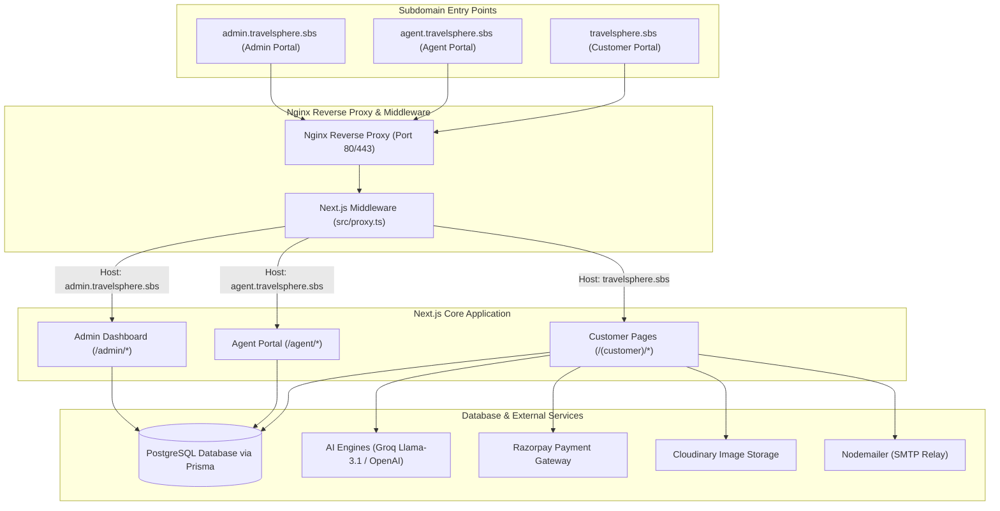
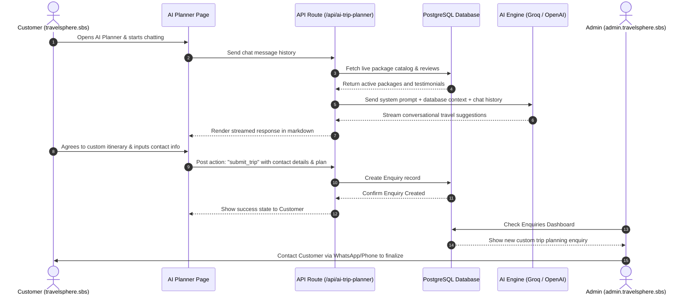
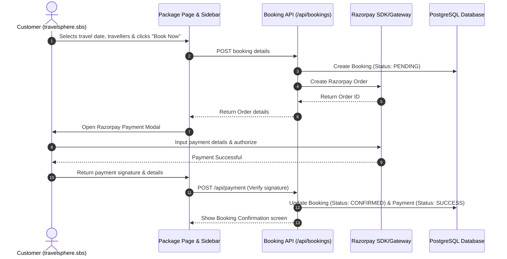
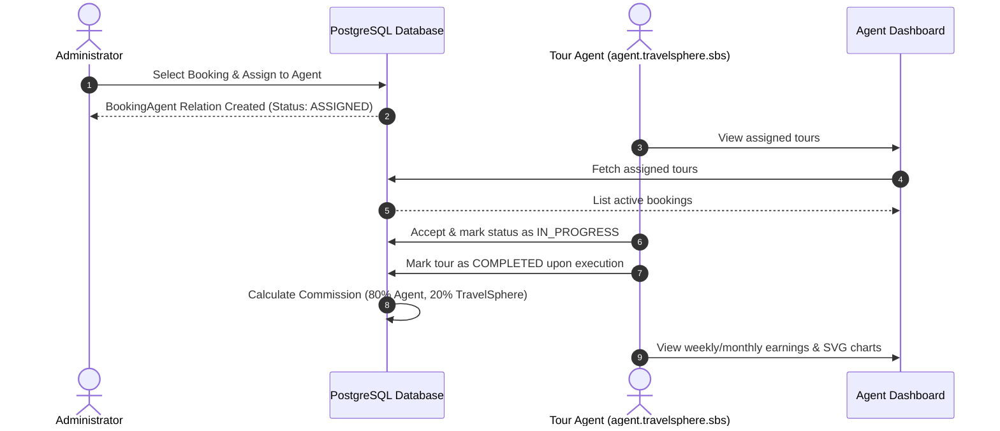

# 🌎 TravelSphere — Smart Tour & Travel System

TravelSphere is a modern, enterprise-grade, multi-portal travel management system. It provides an all-in-one platform for customers to browse packages and plan custom trips using conversational AI, for agents to manage tours and track earnings, and for administrators to oversee bookings, packages, and agent commissions.

Designed as a multi-tenant system, it serves three distinct portals (Customer, Agent, Admin) from a single Next.js deployment using host-based routing.

---

## 🏗️ System Architecture & Subdomain Routing

TravelSphere uses a reverse proxy to route different subdomains to a single Next.js application process. The Next.js middleware (`src/proxy.ts` / `src/middleware.ts`) inspects the host header and rewrites/redirects incoming requests dynamically.



---

## ⚡ Core Workflows

### 1. AI Customised Trip Planning & Enquiry Workflow
Instead of filling out rigid forms, customers converse with **Sphere**, an AI travel consultant. Sphere learns the customer's travel style, suggests destinations, builds detailed markdown itineraries, and submits custom plans to the database for administrative follow-up.



---

### 2. Booking & Razorpay Payment Workflow
Customers can book preset tour packages, select scheduled travel dates, and make payments securely using the integrated Razorpay checkout.



---

### 3. Booking Assignment & Agent Commission Workflow
Confirmed bookings are assigned to local travel agents. Once the agent executes the tour, they earn 80% commission, and the platform retains 20%.



---

## 🛠️ Tools & Technologies Used

| Category | Technology / Library | Description |
| :--- | :--- | :--- |
| **Core Framework** | Next.js 16 (App Router) | React framework for server-side rendering, routing, and serverless APIs. |
| **Database ORM** | Prisma ORM | Type-safe schema definition, migration generation, and database client. |
| **Database** | PostgreSQL | Enterprise-grade relational database storing users, packages, bookings, and agents. |
| **AI Integration** | OpenAI SDK + Groq API | Powers the streaming AI Travel Agent and Trip Planner. |
| **Payment Gateway** | Razorpay SDK | Handles secure online transactions, orders, and payment verifications. |
| **Media Hosting** | Cloudinary & Next-Cloudinary | Uploads, optimizes, and delivers high-resolution package images. |
| **Email Transport** | Nodemailer | Sends email OTP hashes, verification links, and password resets. |
| **Styling & UI** | Tailwind CSS v4 & Headless UI | Modern utility-first CSS framework coupled with unstyled accessible components. |
| **Forms & Validation** | React Hook Form + Zod | Client-side form management integrated with runtime schema validation. |
| **Process Manager** | PM2 | Daemon process manager keeping the Next.js production server running 24/7. |

---

## 🔒 Security Measures

TravelSphere is secured at multiple layers to protect customer data, prevent unauthorized agent access, and block automated attacks.

### 1. Subdomain Isolation & Router Restrictions
The Next.js middleware (`src/proxy.ts` / `src/middleware.ts`) checks the host headers. If a user attempts to access `/admin` or `/agent` endpoints from the base customer domain (`travelsphere.sbs`), the middleware rewrites the request to a `404 Not Found` page. This isolates administrative interfaces from the public customer domain.

### 2. Role-Based Access Control (RBAC)
Session tokens are authenticated and validated using JWTs via `next-auth`. 
- **Admin routes** (`/admin/*`) require a session token with the `ADMIN` role.
- **Agent routes** (`/agent/*`) require a session token with approved agent status (`status === APPROVED`).
- Unauthenticated or unauthorized users are automatically redirected to their respective login portals with a dynamic `callbackUrl`.

### 3. Nginx Security Headers
The Nginx configuration defines strict headers:
- `X-Frame-Options "SAMEORIGIN"` (Customer/Agent) and `X-Frame-Options "DENY"` (Admin) to block clickjacking.
- `Content-Security-Policy "frame-ancestors 'none';"` on the admin subdomain to prevent administrative screens from being embedded in iframes.
- `X-Content-Type-Options "nosniff"` to prevent MIME-sniffing.
- `Referrer-Policy "strict-origin-when-cross-origin"`.

### 4. Sliding-Window Rate Limiting
To prevent abuse of AI APIs, endpoints are rate-limited via an IP-based sliding window:
- **AI Trip Planner** (`/api/ai-trip-planner`): Limited to 60 requests per hour per IP.
- **AI General Agent** (`/api/ai-agent`): Limited to 40 requests per hour per IP.
Over-limit requests receive a `429 Too Many Requests` response.

### 5. Multi-Step Authentication & Verification
- **Email Verification**: User sign-ups are verified via single-use secure OTPs.
- **Password Reset**: Secure OTP validation with expiration times, attempt limits, and resend cooldowns.
- **Bcrypt Hashing**: All user passwords are encrypted using Bcrypt prior to storage.

---

## 🚀 Deployment Guide

The platform is designed to be deployed on a virtual private server (VPS) running Ubuntu 22.04 or 24.04.

### 1. Prerequisites
Configure your DNS provider with wildcards or direct records pointing to your server's IP:
- `travelsphere.sbs` (A record)
- `admin.travelsphere.sbs` (A record)
- `agent.travelsphere.sbs` (A record)

### 2. Automated VPS Setup
The `deployment/deploy.sh` script automates the installation of Node.js 22, Git, PostgreSQL, Nginx, PM2, and Let's Encrypt Certbot.

1. SSH into your VPS as root.
2. Edit `deployment/deploy.sh` to fill in your repo URL, domain, and secure credentials.
3. Run the script:
   ```bash
   chmod +x deployment/deploy.sh
   ./deployment/deploy.sh
   ```

### 3. Process Management (PM2)
PM2 runs the built Next.js application in the background and restarts it on server reboots.
- **Start command:** `pm2 start npm --name "travelsphere" -- run start -- -p 3000`
- **View status:** `pm2 status`
- **View logs:** `pm2 logs travelsphere`

---

## ✨ Unique Features of TravelSphere

1. **Dual AI Interfaces**: 
   - A general-purpose AI chat assistant in the footer/sidebar for quick destination facts, visa information, and recommendations.
   - A full-screen conversational **AI Customised Tour Planner** that listens, constructs rich custom itineraries, calculates budgets, and submits details directly to the admin.
2. **Dynamic Knowledge Base**: The AI does not rely on static training data alone. Real-time details of active packages, testimonials, site policies, and support facts are fetched directly from PostgreSQL and injected into the system prompt at runtime.
3. **Agent Earnings Analytics**: Approved agents access an analytics dashboard equipped with custom SVG charts detailing weekly and monthly performance, booking history, and transparent commission payouts.
4. **Comprehensive Data Seed**: Comes pre-populated with 79 famous travel packages covering beaches, mountains, pilgrimage sites, and adventure spots across North, South, East, West, and Island regions of India, each verified to have unique and relevant photography.
